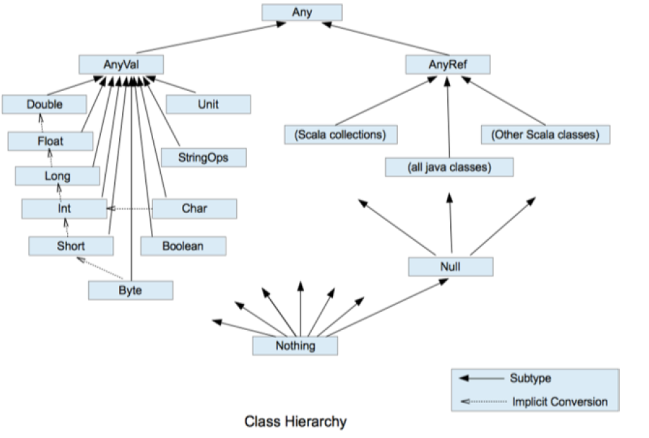

# Scala

## java 与 scala

- scala 是基于java的完全面向对象的，所以去除了java 中的static 和 void 
- scala 使用Unit 类定义无返回值

## scala 反编译
- Object `Hello`编译后生成Hello$.class 和 Hello.class 文件
- Hello.class 的main 函数调用Hello$ 类的静态对象 MODULES$
- Hello$.MODULES$ 对象调用Hello$ 的main 函数

## 变量和数据类型 
### 量和常量
- 尽量使用常量
- 声明变量时可以省略类型，编译器自动推导
- scala 是强类型，类型确定后不可更改
- 变量必须有初始值
- var 修饰的变量可改，val修饰的变量不可改（类似java 的final修饰）
- var 修饰的对象引用可改，val 修饰的对象不可改，但是对象的属性可以改

### 字符串
- 通过+号连接
- printf：用% 进行传值
- 字符串模板：用$ 获取变量值

### 数据类型
- 一切数据皆对象，都是Any 的子类
- 数据类型（AnyVal）和引用类型（AnyRef）
- 低精度类型可以自动转换高精度类型
- Unit：对应Java中的void，表示方法没有返回值。Unit是一个数据类型，只有一个对象就是()。java 的Void不是数据类型，只是一个关键字
- Null是一个类型，只有一个对象就是null。它是所有引用类型（AnyRef）的子类。
- Nothing，是所有数据类型的子类，主要用在一个函数没有明确返回值时使用，因为这样我们可以把抛出的返回值，返回给任何的变量或者函数。

  
### 类型转换
#### 自动转换
- 多类型数据进行运算，自动转换高精度的数据类型再进行运算
- 高精度类型赋值低精度类型将报错
- byte,short 和 char 不会自动转换，计算式需先转换成int 类型
````scala
var n6 : Byte = 1
var c2 : Char = 1
// var n : Short = n6 + c2 当 n6 + c2 结果类型就是 int
// var n7 : Short = 10 + 90 错误
````
#### 强制类型转换
高精度类型向低精度类型进行强制转换
```scala
var n1: Int = 2.5 .toInt // 这个存在精度损失
```
#### String 与 数值类型转换
- 数值类型转String，用+ 号
- String 转数值类型（s 1.toInt 、 s1.toFloat 、 s1.toDouble 、 s1.toByte、s1.toLong 、 s 1.toShort）

### 赋值运算
- `+=,-=,*=,/=,%=,<<=,>>=,&=,^=,|=` 运算后再赋值
- 没有java的`++,--`
## 流程控制
### 分支控制
- if 分支具备返回值的,具体返回值取决于满足条件的代码体的最后一行内容
```scala
println("age:")
    val age = StdIn.readInt()
    val result:String = if (age>30){
      "老人"
    }
    else{
      "年轻人"
    }
    println(result)
```
- 没有switch分支结构

### For 循环控制
- 基本语法
```scala
//前后闭合
for(i <- 1 to 3){
  print(i + " ")
  println()

// 前闭后开
  for(i <- 1 until 3){
    print(i + " ")
    println()
    
// 循环守卫：循环守卫，即循环保护式（也称条件判断式，守卫）。保护式为 true 则进入循环体内部，为 false 则跳过，类似于 continue 。
for (i <- 1 until 5 if i!=2)
      println(i)
  }// 输出 1 3 4

// 循环步长
  for (i <- 1 until 5 by 2)
    println(i)
}// 输出 1 3

// 嵌套循环
for (i <- 1 to 3; j <- 1 to 3)
  println(s"i:$i,j:$j")
}

```
- 循环的返回值：说明：将遍历过程中处理的结果返回到一个新 Vector 集合中，使用 yield 关键字。
```scala
val j = for (i <- 1  to 5) yield {
      i*2
    }
    print(j)//Vector(2, 4, 6, 8, 10)

```
- 倒序打印 reverse
```scala
for(i < 1 to 10 reverse){
  println(i)
}
```

### While 循环控制
- 循环条件是返回一个布尔值的表达式
- while 循环是先判断再执行语句
- 与 for 语句不同，while 语句没有返回值，即整个 while 语句的结果是 Unit 类型
- 因为 while 中没有返回值 ，所以当要用该语句来计算并返回结果时，就不可避免的使用变量，而变量需要声明在 while 循环的外部，那么就等同于循环的内部对外部的变量造成了影响，所以不推荐使用，而是推荐使用 for 循环

### 循环中断
- 使用breakable， 没有break和continue
```scala
Breaks.breakable(
    for (elem < 1 to 10) {
      println(elem)
      if (elem == 5) Breaks.break()
  )
```
## 函数式编程
> 解决问题时，将问题分解成一个一个的步骤，将每个步骤进行封装（函数），通过调用这些封装好的步骤，解决问题。
> 函数的本质：函数可以当做一个值进行传递

- Scala 语言可以在任何的语法结构中声明任何的语法
- 函数没有重载和重写的概念；方法可以进行重载和重写(类中的函数叫方法)
- Scala 中函数可以嵌套定义

```scala
// （1）可变参数
def test( s : String* ): Unit ={
  println(s)
}
// 有输入参数：输出 Array
test("Hello", "Scala")
// 无输入参数：输出 List()
test()
// (2） 如果参数列表中存在多个参数，那么 可变参数一般放置在最后
def test2( name : String, s: String* ): Unit = {
  println(name + "," + s)
}
test2("jinlian", "dalang")

// (3） 参数默认值
def test3( name : String, age : Int = 30 ): Unit ={
  println(s"$name, $age")
}
// 如果参数传递了值，那么会覆盖默认值
test3("jinlian", 20)
// 如果参数有默认值，在调用的时候，可以省略这个参数
test3("dalang")

```
### 函数至简原则
- return 可以省略， Scala 会使用函数体的最后一行代码作为返回值
- 如果函数体只有一行代码，可以省略花括号
- 返回值类型如果能够推断出来，那么可以省略 和返回值类型一起省略）
- 如果有 return ，则不能省略返回值类型，必须指定
- 如果函数明确声明 unit ，那么即使函数体中使用 return 关键字也不起作用
- Scala 如果期望是无返回值类型，可以省略等号
- 如果函数无参，但是声明了参数列表，那么调用时，小括号，可加可不加
- 如果函数没有参数列表，那么小括号可以省略，调用时小括号必须省略
- 如果不关心名称，只关心逻辑处理，那么函数名 def ）可以省略

### 函数高阶用法
- 函数作为值进行传递
```scala
def foo()=println("foo")

    val f=foo
    println(f)
//在被调用函数 foo 后面加上相当于把函数 foo 当成一个整体，传递给变量 f1
    val f1=foo _
    println(f1)
```
- 函数作为函数返回值返回
```scala
def f1() = {
  def f2() = {}
  f2 _
}
val f = f1()
// 因为 f1 函数的返回值依然为函数，所以可以变量 f 可以作为函数继续调用
f()
// 上面的代码可以简化为
f1()()
```
### 匿名函数
> 没有名字的函数就是匿名函数。

- 参数的类型可以省略，会根据形参进行自动的推导
- 类型省略之后 ，发现只有一个参数，则圆括号可以省略；其他情况：没有参数和参数超过 1 的永远不能省略圆括号。
- 匿名函数如果只有一行， 则大括号也可以省略
- 如果参数只出现一次，则参数省略且后面参数可以用_代替

```scala
// 定义一个参数包含数据和函数的函数
    def operation(array: Array[Int],op: Int => Int) ={
      for (i <- array) yield op(i)
    }
    // 定义函数
    def op(ele: Int): Int={
      ele+1
    }
    // 标准函数调用
    val result=operation(Array(1,2,3),op)
    println(result.mkString(","))

    // 匿名函数调用
    val result1=operation(Array(1,2,3),(ele:Int)=> {ele+1})
    println(result1.mkString(","))

    // 参数的类型可以省略，会根据形参进行自动的推导
    val result2=operation(Array(1,2,3),(ele)=> {ele+1})
    println(result2.mkString(","))

    //类型省略之后，发现只有一个参数，则圆括号可以省略；其他情况：没有参数和参数超过 1 的永远不能省略圆括号。
    //匿名函数如果只有一行，则大括号也可以省略
    val result3=operation(Array(1,2,3),ele=> ele+1)
    println(result3.mkString(","))

    //如果参数只出现一次，则参数省略且后面参数可以用_代替
    val result4=operation(Array(1,2,3),_ +1)
    println(result4.mkString(","))

  //两个参数
  def calculate(a:Int,b:Int,add:(Int,Int) => Int):Int={
  add(a,b)
  }
  println(calculate(1,2, _ +_))
```
### 闭包和函数柯里化
> - 闭包：如果一个函数，访问到了它的外部局部变量的值，那么这个函数和他所处的环境，称为闭包。
> - 函数柯里化：把一个参数 列表的多个参数，变成多个参数列表

原理：函数调用时会创建对象实例，包含了这个函数需要的包和变量，所以方法栈的释放不影响局部变量
```scala
def f1()= {
  var a:Int = 1
  def f2(b:Int):Int = {
    a+b
  }
  f2 _
}
//  f1 函数执行完毕后，局部变量 a 应该随着栈空间释放掉。但是scala在调用函数时，会在堆内存创建这个函数的对象实例，并打包保存了所依赖的包和变量，
val f=f1()
// 但是在此处，变量 a 其实并没有释放，而是包含在了 f2 函数的内部，形成了闭合的效果
println(f1()(2))//3
println(f(3))//4
// 函数柯里化，其实就是将复杂的参数逻辑变得简单化 函数柯里化一定存在闭包
def f4()(b:Int) = {
  a + b
}
println(f4()(3))
    
```
### 控住抽象
- 值调用：把计算后的值传递过去
```scala
def main(args: Array[String]): Unit = {
    def f=() => {
      println("f.....")
      10
    }
    foo(f())//把函数f() 的返回值作为参数传递给foo()
//  f.....
//  10
//  10
  }

  def foo(a:Int){
    println(a)
    println(a)
  }
```
- 名传递：传递代码
```scala
  def foo2(a: => Unit): Unit ={
    println(a)
    println(a)
  }

foo2({println("foo2...")})
//foo2...
//()
//foo2...
//()
```
### 惰性加载
> 当函数返回值被声明为 lazy 时 ，函数的执行将被推迟 ，直到我们首次对此取值，该函数才会执行 。这种函数我们称之为惰性函数。
```scala
def main(args: Array[String]): Unit = {
    lazy val result2=sum(1,2)
    println("result2:"+result2)
  }

  def sum(a: Int,b: Int):Int={
    println("调用sum函数")
    a+b
  }
//调用sum函数
//result2:3
```
## 面向对象
- 命名规范：com.公司名.项目名.业务模块名
- 另一种嵌套风格
  - 一个源文件中可以声明多个 package
  - 子包中的类可以直接访问父包中的内容，而无需导包
```scala
package com{
  package atguigu{
    package scala{

    }
  }
}
```
### 包对象
> 在 Scala 中可以为每个包定义一个同名的包对象定义在包对象中的成员作为其对应包下所有 scala 和 object 的共享变量可以被直接访问。

- 包对象- 一般定义在其对应包下的 package.scala 文件中，包对象名与包名保持一致。
- 如采用嵌套方式管理包，则包对象可与包定义在同一文件中，但是要保证包对象与包声明在同一作用域中。
    
### 导包
- 和 Java 一样 ，可以 在 顶部使用 import 导入 在这个文件中的所有类都可以使用。
- 局部导入：什么时候使用，什么时候导入。 在其作用范围内都可以使用。
- 通配符导入： import java.util._
- 给类起名： import java.util.{ArrayList=>JL}
- 导入 相同包的 多个类： import java.util.{HashSet, ArrayList}
- 屏蔽 类： import java.util.{ArrayList =>_,_}
- 导入包的绝对路径： new _root_.java.util.HashMap
- 默认导入： java.lang._, scala._,scala.Predef._
### 类和对象
#### 类
- Scala 中没有 public ，一个 .scala 中可以写多个类 。
#### 访问权限
- Scala 中属性和方法的默认访问权限为 public ，但 Scala 中无 public 关键字。
- private 为私有权限，只在类的内部和伴生对象中可用。
- protected 为受保护权限， Scala 中受保护权限比 Java 中更严格，同类、子类可以访问，同包无法访问。
- private[包名] 增加包访问权限，包名下的其他类也可以使用
#### 对象
- val 修饰对象，不能改变对象的引用(即：内存地址) 可以改变对象属性的值。
- var 修饰对象， 可以修改对象的引用和修改对象的属性值
- 自动推导变量类型不能多态，所以多态需要显示声明

```scala
//val 修饰对象，不能改变对象的引用（即：内存地址），可以改变对象属性的值。
val person = new Person()
person.name = "bobo"
// person = n ew Person() Person()// 错误的
println(person.name)
```
#### 构造器
- 和Java 一样， Scala 构造对象也需要调用构造方法，并且可以有任意多个构造方法。
- 类的构造器包括： 主构造器和辅助构造器
- 辅助 构造器 函数的名称 this ，可以有多个，编译器通过参数的个数 及类型来区分。
- 辅助构造方法不能直接构建对象 ，必须直接或者间接调用主构造方法。 
- 构造器调用其他另外的构造器， 要求被调用构造器必须提前声明。
```scala
//如果主构造器无参数，小括号可省略
//class Person(){
class Person {
  var name: String = _
  var age: Int = _
  println("主构造器")
  def this(age: Int) {
    this()
    this.age = age
    println("辅助构造器")
  }

  def this(age: Int, name: String) {
    this(age)
    this.name = name
  }
}

object Person {
    def main(args: Array[String]): Unit = {
      val person2 = new Person(18)
    }
}
//主构造器
//辅助构造器
```
- 构造器的形参
    - 未用任何修饰符修饰，这个参数就是一个局部变量
    - var 修饰参数，作为类的成员属性使用，可以修改 
    - val 修饰参数，作为类只读属性使用，不能修改

### 继承和多态
- extend
- 子类继承父类的属性和方法 
- 继承的调用顺序： 父类构造器子类构造器
- scala 是单继承
- 属性和方法都是动态绑定的，java 只有方法是
```scala
object TestExtend {
  def main(args: Array[String]): Unit = {
    val emp = new Emp("joson",11,1001)
  }

}
class Person1(nameParam: String) {
  var name = nameParam
  var age: Int = _
  println(" 父类主构造器")
  def this(nameParam: String, ageParam: Int) {
    this(nameParam)
    this.age = ageParam
    println(" 父类辅助构造器")
  }
}
class Emp(nameParam: String, ageParam: Int) extends Person1(nameParam, ageParam) {
  var empNo: Int = _

  def this(nameParam: String, ageParam: Int, empNoParam: Int) {
    this(nameParam, ageParam)
    this.empNo = empNoParam
    println(" 子类的辅助构造器")
  }
  println(" 子类主构造器")
}
//父类主构造器
//父类辅助构造器
//子类主构造器
//子类的辅助构造器
```
### 抽象类和抽象方法
- 定义抽象类：abstract class Person{} 通过 abstract 关键字标记抽象类
- 定义抽象属性：val|var name:String 一个属性没有初始化，就是抽象属性
- 定义抽象方法：def hello():String 只声明而没有实现的方法，就是抽象方法
```scala
abstract class Person {
  val name: String
  def hello(): Unit
}
```
- 如果父类为抽象类，那么子类需要将抽象的属性和方法实现，否则子类也需声明为抽象类.
- 重写非抽象方法需要用 override 修饰，重写抽象方法则可以不加 override.
- 子类中调用父类的方法使用 super 关键字.
- 子类对抽象属性进行实现，父类抽象属性可以用 var 修饰；
子类对非抽象属性重写 ，父类非抽象属性只支持 val 类型，而不支持 var 。
因为 var 修饰的为可变变量，子类继承之后就可以直接使用，没有必要重写
  
### 单例对象
- 单例对象采用 object 关键字声明
- 单例对象对应的类称之为 伴生类 ，伴生对象的名称应该和伴生类名一致。
- 单例对象中的属性和方法都可以通过伴生对象名（类名）直接调用访问。
```scala
object TestSingleton {
  def main(args: Array[String]): Unit = {
    val student1 = Student12.getInstance()
    student1.printInfo()
    //这里创建了新的对象，但是实际上还是跟上边是同一个对象实例
    val student2 = Student12.getInstance()
    student2.printInfo()

    println(student1)
    println(student2)
  }
}

class Student12 private(val name: String, val age: Int){
  def printInfo(){
    println(s"student: name = ${name}, age = $age, school = ${Student11.school}")
  }
}

// 饿汉式
//object Student12 {
//  private val student: Student12 = new Student12("alice", 18)
//  def getInstance(): Student12 = student
//}

// 懒汉式
object Student12 {
  private var student: Student12 = _
  def getInstance(): Student12 = {
    if (student == null){
      // 如果没有对象实例的话，就创建一个
      student = new Student12("alice", 18)
    }
    student
  }
}

//student: name = alice, age = 18, school = atguigu
//student: name = alice, age = 18, school = atguigu
//chapter06.Student12@1fbc7afb
//chapter06.Student12@1fbc7afb
```
#### apply 方法
- 通过伴生对象的 apply 方法， 实现不使用 new 方法创建对象 。
- 如果想让主构造器变成私有的，可以在之前加上 private 。
- apply 方法可以重载。
- Scala 中 obj (arg) 的语句实际是在调用该对象的 apply 方法，即 obj.apply(arg) 。用以统一 面向对象编程和函数式编程的风格。
- 当使用 new 关键字构建对象时，调用的其实是类的构造方法，当直接使用类名构建对象时，调用的其实是伴生对象的 apply 方法。
```scala
object Test11_Object {
  def main(args: Array[String]): Unit = {
    
    val student1 = Student11.newStudent("alice", 18)
    student1.printInfo()
    //通过伴生对象的 apply 方法， 实现不使用 new 方法创建对象 
    val student2 = Student11.apply("bob", 19)
    student2.printInfo()
    //省略方法名
    val student3 = Student11("bob", 19)
    student3.printInfo()
  }
}

// 定义类
class Student11 private(val name: String, val age: Int){
  def printInfo(){
    println(s"student: name = ${name}, age = $age, school = ${Student11.school}")
  }
}

// 伴生对象
object Student11{
  val school: String = "atguigu"

  // 定义一个类的对象实例的创建方法
  def newStudent(name: String, age: Int): Student11 = new Student11(name, age)

  def apply(name: String, age: Int): Student11 = new Student11(name, age)
}

//student: name = alice, age = 18, school = atguigu
//student: name = bob, age = 19, school = atguigu
//student: name = bob, age = 19, school = atguigu
```
### 特质 Trait
- 可以有抽象属性和方法，也可以有具体的属性和方法 一个类可以混入（ mixin ）多个特质 。
- 采用了 extends 关键字 ，如果有多个特质或存在父类，那么需要采用 with 关键字连接。 
- 特质可以同时拥有抽象方法和具体方法 
- 一个类可以混入 (mixin)多个特质 
- 所有的 Java 接口都可以当做 Scala 特质使用 
- 动态混入 ：可灵活的扩展类的功能，即是在对象实例化时才实现接口方法
```scala
object Test14_TraitMixin {
  def main(args: Array[String]): Unit = {
    val student = new Student14
    student.study()
    student.increase()

    student.play()
    student.increase()

    student.dating()
    student.increase()

    println("===========================")
    // 动态混入：
    val studentWithTalent: Any = new Student14 with Talent {
      override def dancing(): Unit = println(s"student $name is good at dancing")

      override def singing(): Unit = println(s"student $name is good at singing")
    }

    studentWithTalent.sayHello()
    studentWithTalent.play()
    studentWithTalent.study()
    studentWithTalent.dating()
    studentWithTalent.dancing()
    studentWithTalent.singing()
  }
}

// 再定义一个特质
trait Knowledge {
  var amount: Int = 0

  def increase(): Unit
}

trait Talent {
  def singing(): Unit

  def dancing(): Unit
}

class Student14 extends Person13 with Young with Knowledge {
  // 存在父子类冲突的属性，必须重写
  override val name: String = "joson"

  // 实现抽象方法
  def dating(): Unit = println(s"student $name is dating")

  def study(): Unit = println(s"student $name is studying")

  // 重写父类方法
  override def sayHello(): Unit = {
    super.sayHello()
    println(s"hello from: student $name")
  }

  // 实现特质中的抽象方法
  override def increase(): Unit = {
    amount += 1
    println(s"student $name knowledge increased: $amount")
  }
}
//student joson is dating
//student joson knowledge increased: 3
//===========================
//hello from: joson
//hello from: student joson
//young people joson is playing
//student joson is studying
//student joson is dating
//student joson is good at dancing
//student joson is good at singing
```
- 特质的叠加：当类有多个父类或者特质时，加载顺序是从右到左，即从后面加载
- 调用某个指定的混入特质中的方法，可以增加约束：super[]，如：super[Young].describe() 。

#### 特质与继承
- 优先使用特质。一个类扩展多个特质是很方便的，但却只能扩展一个抽象类。
- 如果你需要构造函数参数，使用抽象类。因为抽象类可以定义 带参数 的构造函数，而特质不行有无参构造

### 扩展
#### 类型检查和转换
- obj.isInstanceOf[T] ：判断 obj 是不是 T 类型。
- obj.asInstanceOf[T] ：将 obj 强转成 T 类型。
- classOf 获取对象的类名。
#### 枚举类和应用类
- 枚举类：需要继承 Enumeration
- 应用类：需要继承 App
```scala
object WorkDay extends Enumeration {
  val MONDAY = Value(1, "Monday")
  val TUESDAY = Value(2, "TuesDay")
}

// 定义应用类对象,这里类TestApp可以直接启动，无需定义main方法
object TestApp extends App {
  // 2. 测试枚举类
  println(WorkDay.MONDAY)
  println("app start")
}
```
## 集合
- Scala 的集合有三大类：序列 Seq 、集 Set 、 映射 Map 所有的集合都扩展自 Iterable 特质
- 对于几乎所有的集合类 Scala 都同时提供了可变和不可变的版本，分别位于以下两个包。
    - 不可变集合： scala.collection.immutable
    - 可变集合： scala.collection.mutable
- 不可变集合，就是指该集合对象不可修改，每次修改就会返回一个新对象，而不会对原对象进行修改。类似于 java 中的 String 对象。
- 可变集合，就是这个集合可以直接对原对象进行修改，而不会返回新的对象。类似于 java 中 StringBuilder 对象
### 数组
#### 不可变数组
```scala
object Test01_ImmutableArray {
  def main(args: Array[String]): Unit = {
    // 1. 创建数组
    val arr: Array[Int] = new Array[Int](5)
    // 另一种创建方式
    val arr2 = Array(12, 37, 42, 58, 97)
    println(arr)

    // 2. 访问元素
    println(arr(0))
    println(arr(1))
    println(arr(4))
//    println(arr(5)) // 索引越界
    // 更新数组
    arr(0) = 12
    arr(4) = 57
    println(arr(0))
    println(arr(1))
    println(arr(4))

    println("========================")

    // 3. 数组的遍历
    // 1) 普通for循环
    for (i <- 0 until arr.length){
      println(arr(i))
    }

    for (i <- arr.indices) println(arr(i))

    println("---------------------")

    // 2) 直接遍历所有元素，增强for循环
    for (elem <- arr2) println(elem)

    println("---------------------")

    // 3) 迭代器
    val iter = arr2.iterator

    while (iter.hasNext)
      println(iter.next())

    println("---------------------")

    // 4) 调用foreach方法
    arr2.foreach( (elem: Int) => println(elem) )

    arr.foreach( println )

    println(arr2.mkString("--"))

    println("========================")
    // 4. 添加元素,这里是创建新数组
    val newArr = arr2.:+(73)//末尾添加元素
    println(arr2.mkString("--"))
    println(newArr.mkString("--"))

    val newArr2 = newArr.+:(30)//最前面添加元素
    println(newArr2.mkString("--"))

    val newArr3 = newArr2 :+ 15
    val newArr4 = 19 +: 29 +: newArr3 :+ 26 :+ 73 //注意这里19,29应该摆放在前面
    println(newArr4.mkString(", "))
  }
}
```
#### 可变数组
```scala
object Test02_ArrayBuffer {
  def main(args: Array[String]): Unit = {
    // 1. 创建可变数组
    val arr1: ArrayBuffer[Int] = new ArrayBuffer[Int]()//默认长度是16
    val arr2 = ArrayBuffer(23, 57, 92)

    println(arr1)
    println(arr2)

    // 2. 访问元素
//    println(arr1(0))     // error 该数组没有元素
    println(arr2(1))
    arr2(1) = 39
    println(arr2(1))

    println("======================")
    // 3. 添加元素
    val newArr1 = arr1 :+ 15 //该方式针对不可变数组的新增元素，所以会新建数组
    println(arr1)
    println(newArr1)
    println(arr1 == newArr1) // false

    val newArr2 = arr1 += 19 // 该方式针对可变数组，newArr2 也指向了arr1 引用的实例对象
    println("arr1:"+arr1) //这里返回arr1:ArrayBuffer(19)
    println(newArr2) 
    println(arr1 == newArr2)// true
    newArr2 += 13 // 当新增元素13，arr1返回 arr1:ArrayBuffer(19, 13)，所以可变数组在元素操作时不推荐赋值新的引用
    println("arr1:"+arr1)

    77 +=: arr1 
    println(arr1) //ArrayBuffer(77, 19, 13)
    println(newArr2) //ArrayBuffer(77, 19, 13)
    
    // 可变数组推荐使用方法新增元素
    arr1.append(36) //末尾追加36
    arr1.prepend(11, 76) // 开头追加11和76
    arr1.insert(1, 13, 59) // 在索引1的位置添加13和59
    println(arr1)//ArrayBuffer(11, 13, 59, 76, 77, 19, 13, 36)

    
    arr1.insertAll(2, newArr1)//添加数组
    arr1.prependAll(newArr2)

    println(arr1)//ArrayBuffer(11, 13, 15, 59, 76, 77, 19, 13, 36, 11, 13, 15, 59, 76, 77, 19, 13, 36)

    // 4. 删除元素
    arr1.remove(3)//删除在索引3位置的元素
    println(arr1)//ArrayBuffer(11, 13, 15, 76, 77, 19, 13, 36, 11, 13, 15, 59, 76, 77, 19, 13, 36)

    arr1.remove(0, 10)// 从位置0 开始删除10个元素
    println(arr1)//ArrayBuffer(15, 59, 76, 77, 19, 13, 36)

    arr1 -= 13 // 删除指定值的元素,不存在则什么都不做
    println(arr1)//ArrayBuffer(15, 59, 76, 77, 19, 36)

    // 5. 可变数组转换为不可变数组
    val arr: ArrayBuffer[Int] = ArrayBuffer(23, 56, 98)
    val newArr: Array[Int] = arr.toArray
    println(newArr.mkString(", "))
    println(arr)

    // 6. 不可变数组转换为可变数组
    val buffer: mutable.Buffer[Int] = newArr.toBuffer
    println(buffer)
    println(newArr)
  }
}
```
#### 二维数组
```scala
object Test03_MulArray {
  def main(args: Array[String]): Unit = {
    // 1. 创建二维数组
    val array: Array[Array[Int]] = Array.ofDim[Int](2, 3)

    // 2. 访问元素
    array(0)(2) = 19
    array(1)(0) = 25

    println(array.mkString(", "))//[I@880ec60, [I@36d64342
    for (i <- 0 until array.length; j <- 0 until array(i).length){
      println(array(i)(j))
    }
    for (i <- array.indices; j <- array(i).indices){
      print(array(i)(j) + "\t")
      if (j == array(i).length - 1) println()
    }
//    0	0	19
//    25	0	0

    array.foreach(line => line.foreach(println))

    array.foreach(_.foreach(println))
  }
}
```
#### 不可变列表
```scala
object Test04_List {
  def main(args: Array[String]): Unit = {
    // List 默认为不可变集合
    // 1 . 创建一个List
    val list1 = List(23, 65, 87)
    println(list1)//List(23, 65, 87)

    // 2. 访问和遍历元素
    println(list1(1))
//    list1(1) = 12 // 无法更新元素
    list1.foreach(println)

    // 3. 添加元素
    val list2 = 10 +: list1 //
    val list3 = list1 :+ 23
    println(list1)
    println(list2) //List(10, 23, 65, 87)
    println(list3) //List(23, 65, 87, 23)

    println("==================")
    //::的运算规则从右向左
    val list4 = list2.::(51) //list2 开头加51
    println(list4) //List(51, 10, 23, 65, 87)

    val list5 = Nil.::(13) // 空列表开头添加13
    println(list5)//List(13)

    val list6 = 73 :: 32 :: Nil
    val list7 = 17 :: 28 :: 59 :: 16 :: Nil
    println(list7) // List(17, 28, 59, 16)

    // 4. 合并列表
    val list8 = list6 :: list7//在列表list7开头添加list6
    println(list8)//List(List(73, 32), 17, 28, 59, 16)

    // 集合间合并：将一个整体拆成一个一个的个体，称为扁平化
    val list9 = list6 ::: list7 
    println(list9)//List(73, 32, 17, 28, 59, 16)

    val list10 = list6 ++ list7
    println(list10)//List(73, 32, 17, 28, 59, 16)

  }
}
```
#### 可变列表
```scala
object Test05_ListBuffer {
  def main(args: Array[String]): Unit = {
    // 1. 创建可变列表
    val list1: ListBuffer[Int] = new ListBuffer[Int]()
    val list2 = ListBuffer(12, 53, 75)

    println(list1)//ListBuffer()
    println(list2)//ListBuffer(12, 53, 75)

    println("==============")

    // 2. 添加元素
    list1.append(15, 62)
    list2.prepend(20)

    list1.insert(1, 19, 22) // 指定位置添加元素

    println(list1)//ListBuffer(15, 19, 22, 62)
    println(list2)//ListBuffer(20, 12, 53, 75)

    println("==============")

    31 +=: 96 +=: list1 += 25 += 11
    println(list1)//ListBuffer(31, 96, 15, 19, 22, 62, 25, 11)

    println("==============")
    // 3. 合并list
    val list3 = list1 ++ list2
    println(list1) //    ListBuffer(31, 96, 15, 19, 22, 62, 25, 11)
    println(list2) //    ListBuffer(20, 12, 53, 75)
    println(list3) //    ListBuffer(31, 96, 15, 19, 22, 62, 25, 11, 20, 12, 53, 75)
    
    println("==============")

    //list1 ++= list2 // 在list1 合并了list2
    list1 ++=: list2 // 在list2 合并了list1
    println(list1)//ListBuffer(31, 96, 15, 19, 22, 62, 25, 11)
    println(list2)//ListBuffer(31, 96, 15, 19, 22, 62, 25, 11, 20, 12, 53, 75)

    println("==============")

    // 4. 修改元素
    list2(3) = 30
    list2.update(0, 89)//指定位置修改元素
    println(list2)//ListBuffer(89, 96, 15, 30, 22, 62, 25, 11, 20, 12, 53, 75)

    // 5. 删除元素
    list2.remove(2)
    list2 -= 25// 删除指定值的元素
    println(list2)//ListBuffer(89, 96, 30, 22, 62, 11, 20, 12, 53, 75)
  }
}
```
### 集合
- Scala 中的不可变集合和可变集合都是Set
- 默认情况下，Scala 使用的是不可变集合，如果你想使用可变集合，需要引用scala.collection.mutable.Set 包
#### 不可变Set
- Set 默认是不可变集合，数据无序
- 数据不可重复
```scala
object Test06_ImmutableSet {
  def main(args: Array[String]): Unit = {
    // 1. 创建set
    val set1 = Set(13, 23, 53, 12, 13, 23, 78)
    println(set1)//Set(78, 53, 13, 12, 23)
    println("==================")

    // 2. 添加元素
    val set2 = set1 + 129
    println(set1)
    println(set2)//Set(78, 53, 13, 129, 12, 23)
    println("==================")

    // 3. 合并set
    val set3 = Set(19, 13, 23, 53, 67, 99)
    val set4 = set2 ++ set3
    println(set2)
    println(set3)
    println(set4)//Set(78, 53, 13, 129, 12, 67, 99, 23, 19)

    // 4. 删除元素
    val set5 = set3 - 13
    println(set3)
    println(set5)//Set(53, 67, 99, 23, 19)
  }
}
```
#### 可变Set
```scala
import scala.collection.mutable

object Test07_MutableSet {
  def main(args: Array[String]): Unit = {
    // 1. 创建set
    val set1: mutable.Set[Int] = mutable.Set(13, 23, 53, 12, 13, 23, 78)
    println(set1)//Set(12, 78, 13, 53, 23)
    println("==================")

    // 2. 添加元素
    val set2 = set1 + 11
    println(set1)
    println(set2)//Set(12, 78, 13, 53, 11, 23)

    set1 += 11
    println(set1)//Set(12, 78, 13, 53, 11, 23)

    val flag1 = set1.add(10) // 返回是否添加成功
    println(flag1)//true
    println(set1)//Set(12, 78, 13, 53, 10, 11, 23)
    val flag2 = set1.add(10)
    println(flag2)// false
    println(set1)
    println("==================")

    // 3. 删除元素
    set1 -= 11
    println(set1)//Set(12, 78, 13, 53, 10, 23)

    val flag3 = set1.remove(10)// 返回是否删除成功
    println(flag3)//true
    println(set1)//Set(12, 78, 13, 53, 23)
    val flag4 = set1.remove(10)
    println(flag4)//false
    println(set1)
    println("==================")

    // 4. 合并两个Set
    val set3 = mutable.Set(12,23,34)
    val set4 = set2 ++ set3
    println(set2)//Set(12, 78, 13, 53, 11, 23)
    println(set3)//Set(12, 34, 23)
    println(set4)//Set(12, 78, 34, 13, 53, 11, 23)

    set2 ++= set3
    println(set2)//Set(12, 78, 34, 13, 53, 11, 23)
    println(set3)
  }
}
```
### Map 集合
#### 不可变Map
```scala
object Test08_ImmutableMap {
  def main(args: Array[String]): Unit = {
    // 1. 创建map
    val map1: Map[String, Int] = Map("a" -> 13, "b" -> 25, "hello" -> 3)
    println(map1)
    println(map1.getClass)

    println("==========================")
    // 2. 遍历元素
    map1.foreach(println)
    map1.foreach( (kv: (String, Int)) => println(kv) )

    println("============================")

    // 3. 取map中所有的key 或者 value
    for (key <- map1.keys){
      println(s"$key ---> ${map1.get(key)}")
    }
//    a ---> Some(13)
//    b ---> Some(25)
//    hello ---> Some(3)

    // 4. 访问某一个key的value
    println("a: " + map1.get("a").get) //这里如果不存在将抛出异常，所以不推荐
    println("c: " + map1.get("c"))//c: None
    println("c: " + map1.getOrElse("c", 0))// 推荐这种，不存在给定默认值

    println(map1("a"))//13
  }
}
```
#### 可变Map
```scala
import scala.collection.mutable

object Test09_MutableMap {
  def main(args: Array[String]): Unit = {
    // 1. 创建map
    val map1: mutable.Map[String, Int] = mutable.Map("a" -> 13, "b" -> 25, "hello" -> 3)
    println(map1)//Map(b -> 25, a -> 13, hello -> 3)
    println(map1.getClass)//class scala.collection.mutable.HashMap
    println("==========================")

    // 2. 添加元素
    map1.put("c", 5)
    map1.put("d", 9)
    println(map1)//Map(b -> 25, d -> 9, a -> 13, c -> 5, hello -> 3)

    map1 += (("e", 7))//注意两个括号
    println(map1)//Map(e -> 7, b -> 25, d -> 9, a -> 13, c -> 5, hello -> 3)
    println("====================")

    // 3. 删除元素
    println(map1("c"))
    map1.remove("c")//0
    println(map1.getOrElse("c", 0))

    map1 -= "d"
    println(map1)//Map(e -> 7, b -> 25, a -> 13, hello -> 3)

    println("====================")

    // 4. 修改元素
    map1.update("c", 5)
    map1.update("e", 10)
    println(map1)//Map(e -> 10, b -> 25, a -> 13, c -> 5, hello -> 3)

    println("====================")

    // 5. 合并两个Map, 存在key 即修改对应value，存在覆盖
    val map2: Map[String, Int] = Map("aaa" -> 11, "b" -> 29, "hello" -> 5)
//    map1 ++= map2
    println(map1)//Map(e -> 10, b -> 25, a -> 13, c -> 5, hello -> 3)
    println(map2)//Map(aaa -> 11, b -> 29, hello -> 5)

    println("---------------------------")
    val map3: Map[String, Int] = map2 ++ map1 // map1将覆盖map2
    println(map1)
    println(map2)
    println(map3)//Map(e -> 10, a -> 13, b -> 25, c -> 5, hello -> 3, aaa -> 11)
  }
}
```
#### 元组
- 是将多个无关的数据封装为一个整体，称为元组。
- 注意：元组中最大只能有 22 个元素。
```scala
object Test10_Tuple {
  def main(args: Array[String]): Unit = {
    // 1. 创建元组
    val tuple: (String, Int, Char, Boolean) = ("hello", 100, 'a', true)
    println(tuple)

    // 2. 访问数据
    println(tuple._1)
    println(tuple._2)
    println(tuple._3)
    println(tuple._4)

    println(tuple.productElement(1))

    println("====================")
    // 3. 遍历元组数据
    for (elem <- tuple.productIterator)
      println(elem)

    // 4. 嵌套元组
    val mulTuple = (12, 0.3, "hello", (23, "scala"), 29)
    println(mulTuple._4._2)
  }
}
//(hello,100,a,true)
//hello
//100
//a
//true
//100
//====================
//hello
//100
//a
//true
//scala
```
### 集合的函数
```scala
object Test11_CommonOp {
  def main(args: Array[String]): Unit = {
    val list = List(1,3,5,7,2,89)
    val set = Set(23,34,423,75)

    //    （1）获取集合长度
    println(list.length)

    //    （2）获取集合大小
    println(set.size)

    //    （3）循环遍历
    for (elem <- list)
      println(elem)

    set.foreach(println)

    //    （4）迭代器
    for (elem <- list.iterator) println(elem)

    println("====================")
    //    （5）生成字符串
    println(list)
    println(set)
    println(list.mkString("--"))//1--3--5--7--2--89

    //    （6）是否包含
    println(list.contains(23))
    println(set.contains(23))
  }
}
```
#### 衍生集合
```scala
object Test12_DerivedCollection {
  def main(args: Array[String]): Unit = {
    val list1 = List(1,3,5,7,2,89)
    val list2 = List(3,7,2,45,4,8,19)

    //    （1）获取集合的头
    println(list1.head)

    //    （2）获取集合的尾（不是头的就是尾）
    println(list1.tail)

    //    （3）集合最后一个数据
    println(list2.last)

    //    （4）集合初始数据（不包含最后一个的其他所有元素）
    println(list2.init)

    //    （5）反转
    println(list1.reverse)

    //    （6）取前（后）n个元素
    println(list1.take(3))
    println(list1.takeRight(4))

    //    （7）去掉前（后）n个元素
    println(list1.drop(3))
    println(list1.dropRight(4))

    println("=========================")
    //    （8）并集
    val union = list1.union(list2)
    println("union: " + union)
    println(list1 ::: list2)

    // 如果是set做并集，会去重
    val set1 = Set(1,3,5,7,2,89)
    val set2 = Set(3,7,2,45,4,8,19)

    val union2 = set1.union(set2)
    println("union2: " + union2)//union2: Set(5, 89, 1, 2, 45, 7, 3, 8, 19, 4)
    println(set1 ++ set2)//Set(5, 89, 1, 2, 45, 7, 3, 8, 19, 4)

    println("-----------------------")
    //    （9）交集
    val intersection = list1.intersect(list2)
    println("intersection: " + intersection)//intersection: List(3, 7, 2)

    println("-----------------------")
    //    （10）差集
    val diff1 = list1.diff(list2)
    val diff2 = list2.diff(list1)
    println("diff1: " + diff1)
    println("diff2: " + diff2)

    println("-----------------------")
    //    （11）拉链: 两个集合相同位置的元素进行配对形成元组。
    //    如果两个集合的元素个数不相等，那么会将同等数量的数据进行拉链，多余的数据省略不用
    //    val list1 = List(1,3,5,7,2,89)
    //    val list2 = List(3,7,2,45,4,8,19)
    println("zip: " + list1.zip(list2))//zip: List((1,3), (3,7), (5,2), (7,45), (2,4), (89,8))
    println("zip: " + list2.zip(list1))//zip: List((3,1), (7,3), (2,5), (45,7), (4,2), (8,89))

    println("-----------------------")
    //    （12）滑窗: 按照给定长度滑动返回元素组
    for (elem <- list1.sliding(3))
      println(elem)
//    List(1, 3, 5)
//    List(3, 5, 7)
//    List(5, 7, 2)
//    List(7, 2, 89)
    println("-----------------------")
    // 默认滑动步长为1
    for (elem <- list2.sliding(4, 2))// 指定步长为2
      println(elem)
//    List(3, 7, 2, 45)
//    List(2, 45, 4, 8)
//    List(4, 8, 19)
    println("-----------------------")
    // 滚动窗口
    for (elem <- list2.sliding(3, 3))
      println(elem)
//    List(3, 7, 2)
//    List(45, 4, 8)
//    List(19)
  }
}
```
#### 集合计算函数
```scala
object Test13_SimpleFunction {
  def main(args: Array[String]): Unit = {
    val list = List(5,1,8,2,-3,4)
    val list2 = List(("a", 5), ("b", 1), ("c", 8), ("d", 2), ("e", -3), ("f", 4))

    //    （1）求和
    var sum = 0
    for (elem <- list){
      sum += elem
    }
    println(sum)
    // 直接求和
    println(list.sum)

    //    （2）求乘积
    println(list.product)

    //    （3）最大值
    println(list.max)
    println(list2.maxBy( (tuple: (String, Int)) => tuple._2 ))//对复杂集合指定比较的值，默认比较第一个值。
    println(list2.maxBy( _._2 ))

    //    （4）最小值
    println(list.min)
    println(list2.minBy(_._2))//(e,-3)

    println("========================")

    //    （5）排序
    // 5.1 sorted
    val sortedList = list.sorted// 默认从小到大排序
    println(sortedList)

    // 从大到小逆序排序
    println(list.sorted.reverse)
    // 传入隐式参数，修改排序规则实现逆序
    println(list.sorted(Ordering[Int].reverse))

    println(list2.sorted)//默认以第一个值排序

    // 5.2 sortBy
    // 复杂集合指定排序的值
    println(list2.sortBy(_._2))
    println(list2.sortBy(_._2)(Ordering[Int].reverse))

    // 5.3 sortWith
    // 基于函数的排序，通过一个comparator 函数，实现自定义排序的逻辑。
    // 指定排序的规则，相当于java 的compare
    println(list.sortWith( (a: Int, b: Int) => {a < b} ))//List(-3, 1, 2, 4, 5, 8)
    println(list.sortWith( _ < _ ))//List(-3, 1, 2, 4, 5, 8)
    println(list.sortWith( _ > _))//List(8, 5, 4, 2, 1, -3)
  }
}
```
#### 转化映射map
```scala
object Test14_HighLevelFunction_Map {
  def main(args: Array[String]): Unit = {
    val list = List(1,2,3,4,5,6,7,8,9)

    // 1. 过滤
    // 选取偶数
    val evenList = list.filter( (elem: Int) => {elem % 2 == 0} )
    println(evenList)

    // 选取奇数
    println(list.filter( _ % 2 == 1 ))

    println("=======================")

    // 2. 转化映射map: 将集合中的每一个元素映射到某一个函数
    // 把集合中每个数乘2
    println(list.map(_ * 2))
    println(list.map( x => x * x))

    println("=======================")

    // 3. 扁平化
    val nestedList: List[List[Int]] = List(List(1,2,3),List(4,5),List(6,7,8,9))

    val flatList = nestedList(0) ::: nestedList(1) ::: nestedList(2)
    println(flatList)

    val flatList2 = nestedList.flatten
    println(flatList2)

    println("=======================")

    // 4. 扁平映射
    // 将一组字符串进行分词，并保存成单词的列表
    val strings: List[String] = List("hello world", "hello scala", "hello java", "we study")
    val splitList: List[Array[String]] = strings.map( _.split(" ") )    // 分词
    val flattenList = splitList.flatten    // 打散扁平化
    println(flattenList)
    
    // 扁平化+映射: flatMap 相当于先进行map 操作，在进行 flatten 操作集合中的每个元素的子元素映射到某个函数并返回新集合
    val flatmapList = strings.flatMap(_.split(" "))
    println(flatmapList)

    println("========================")

    // 5. 分组groupBy：按照指定的规则对集合的元素进行分组
    // 分成奇偶两组
    val groupMap: Map[Int, List[Int]] = list.groupBy( _ % 2)
    val groupMap2: Map[String, List[Int]] = list.groupBy( data => if (data % 2 == 0) "偶数" else "奇数")

    println(groupMap)
    println(groupMap2)

    // 给定一组词汇，按照单词的首字母进行分组
    val wordList = List("china", "america", "alice", "canada", "cary", "bob", "japan")
    println( wordList.groupBy( _.charAt(0) ) )
  }
}
```

#### 简化（归约）reduce
- Reduce简化（归约） ：通过指定的逻辑将集合中的数据进行聚合，从而减少数据，最终获取结果。
```scala
object Test15_HighLevelFunction_Reduce {
  def main(args: Array[String]): Unit = {
    val list = List(1,2,3,4)

    // 1. reduce
    println(list.reduce( _ + _ ))
    println(list.reduceLeft(_ + _))
    println(list.reduceRight(_ + _))

    println("===========================")

    val list2 = List(3,4,5,8,10)
    println(list2.reduce(_ - _))    // -24
    println(list2.reduceLeft(_ - _))
    //reduceRight 底层是递归函数
    println(list2.reduceRight(_ - _))    // 3 - (4 - (5 - (8 - 10))), 6
    println("===========================")
    // 2. fold：使用了函数柯里化，存在两个参数列表
    // 第一个参数列表为 零值（初始值）
    // 第二个参数列表为： 简化规则
    // fold 底层其实为 foldLeft
    println(list.fold(10)(_ + _))     // 10 + 1 + 2 + 3 + 4
    println(list.foldLeft(10)(_ - _))    // 10 - 1 - 2 - 3 - 4
    println(list2.foldRight(11)(_ - _))    // 3 - (4 - (5 - (8 - (10 - 11)))),  -5
  }
}
```
#### Map 合并
- 上边 `map1+map2` 的并不是真正的合并，相同的key 会出现value 覆盖的结果 
- 但这是这在大数据的分布式处理中，应该是相同key 的处理结果进行相加合并

```scala
import scala.collection.mutable

object Test16_MergeMap {
  def main(args: Array[String]): Unit = {
    val map1 = Map("a" -> 1, "b" -> 3, "c" -> 6)
    val map2 = mutable.Map("a" -> 6, "b" -> 2, "c" -> 9, "d" -> 3) // 可变map进行更新
//    println(map1 ++ map2)
    val map3 = map1.foldLeft(map2)(
      (mergedMap, kv) => {
        val key = kv._1
        val value = kv._2
        mergedMap(key) = mergedMap.getOrElse(key, 0) + value
        mergedMap
      }
    )

    println(map3)
  }
}
```


